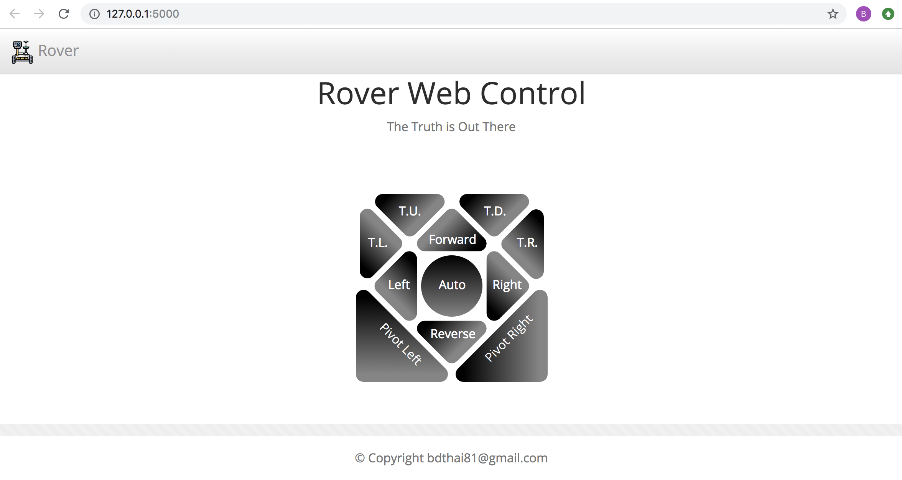
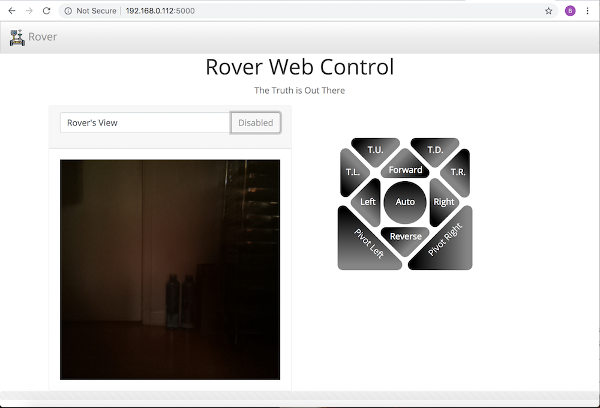
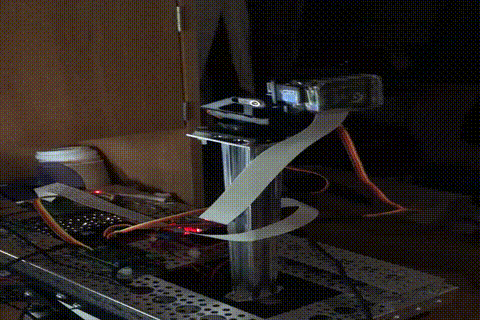
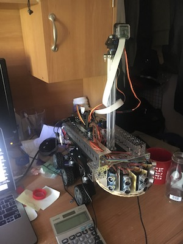

Objective: Utilize reinforcement learning, so rover can auto-pilot.

Phase 1:
* Assembled rover (File "Rover Parts List", contains the core parts used)
* Wired motors with H Bridge & Raspberry Pi 3b+
* Setup Raspberry Pi 3B+ env. w/ anaconda (File "Rover Env Setup", describe the steps taken)
* Coded Motor.py to test rover motions: forward, reverse, turn left, turn right, pivot left, and pivot right
* uploaded image of rover

Phase 2:
* Coded Web Control webpage: bootstrap, svg, javascript
  - Made web control buttons from svg. 
* Integrated Flask with web control and motor.py: Python, Ajax, D3
  - Mouse/Touch screen: on click, motor will run for 0.1s. on hold, motor will run increments of 0.5s continuously.

Phase 3:
* Added Rover View into Web Control webpage: flask, bootstrap, javascript
  - Used picamera
* Updated web control: mouse down, start motion. mouse up, end motion.

Phase 4:
* Added camera tilt feature: webpage, flask, javascript, python
  - Used pololu maestro servo controller (https://www.pololu.com/docs/0J40)  & it's serial servo commands.
    - One heck of a learning curve. Especially, when the customer service reply with, "We do not support the Maestro Control Center on ARM-based Linux machines like the Raspberry Pi.  You can find this information under the "Supported Operating Systems" section of the Maestro user's guide."  
    - Wished I've done more research before I made the purchase, instead of just buying the controller posted on the robotic vendor list.
    - Regardless, figured it out by from some tinkering and good resources (https://github.com/FRC4564/Maestro) along with the sdk.

Phase 5:
* Added distance sensors to front of Rover
  - Used 5 HC-SR04 units to measure object(s) distance from the front of rover.
  - Coded TRIG outputs to fire from Maestro servo controller (set channels 13-17).
  - Coded ECHO inputs to detect returned sonar wave from GPIO pins.
* Update display of sensors' distance on Web Controller page every 0.5sec atm.
* Pending on longer jumper wires to attach sensors to front (thus, no image atm).

Phase 6:
* Restructure the app after a better understanding the project's modules.
  - Added settings.py: Set all the channel variables in GPIO, H-Bridge, and Maestro Controller
  - Updated motor.py, sensor.py, camera_tilt.py: Define the functions under a Class for easier OO handling.
  - Updated app.py: updated app.py to handle the new classes
* Will touch up the front end coding next. Found a lot of inspiration after going thru the D3 advance lessons this week from my Instructor Aash Anand (Great motivitor).
