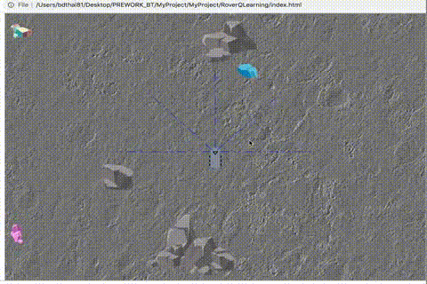

Project objective
* To gather data from user interaction, by navigating the rover through a safe passage to collect mineral deposit.
  - 5 sensors' distance from block/mineral object
  - user's command
  - Reward/penality points base on action(s) for Q-Learning
* Data gathered will be used to train rover with reinforcement learning (qlearning) to auto-pilot.

Dev. tools: Bootstrap, D3.js

---
Phase 1:
* Environment is based on a scale system of 1pixel = 1cm (real world)
* Created index.html with storyline & instructions
* Created svg rover object (physical size ~50cm length x ~25cm width)
  - Added 5 sensors line & camera view object within
* Added moon landscape background theme
* Added 3 mineral objects (blue, green, pink) to detect and reach as goal. 
* Added 5 blockage objects (small/medium/large boulders, potholes 1,2)

Phase 2:
* Integrated keyboard event handlers for rover movements (currently: forward, reverse, pivot left, pivot right)
  - Thank you, Tom MacWright, for an excellent example of keyboard event handling (http://bl.ocks.org/tmcw/4444952)

Phase 3:
* Sensors detection of object's distance
  - Thank you, Mike Bostock, for another great reference to start from (https://bl.ocks.org/mbostock/8027637)
* Usage of vectors and dotproduct to check if each of the rover's sensors are within range of an object.
  - We're basing the max range as 200 pixel (~200cm). 
    - HC-SR04 claims to work best from 2cm-400cm.
    - For more reliabilty sensor reading data, I set the cap at 200cm. 

Phase 4:
* Integrated Rover's object sensors with the app.
  - Algorithm to detect object's distance
    - Wrote a prototype "testRotation.html" to figure out the sensor's range (rectangle) for each object based off the rover's position and angle
    - Used vector & dotproduct to test if rover's sensor point is within the object's sensor range (rectangle)
    - Used Mike Bostock's closestPath to figure out the distance within the max range (200px/cm).
* Fine tuned the rover's pivot angle to 15 degrees.
    

